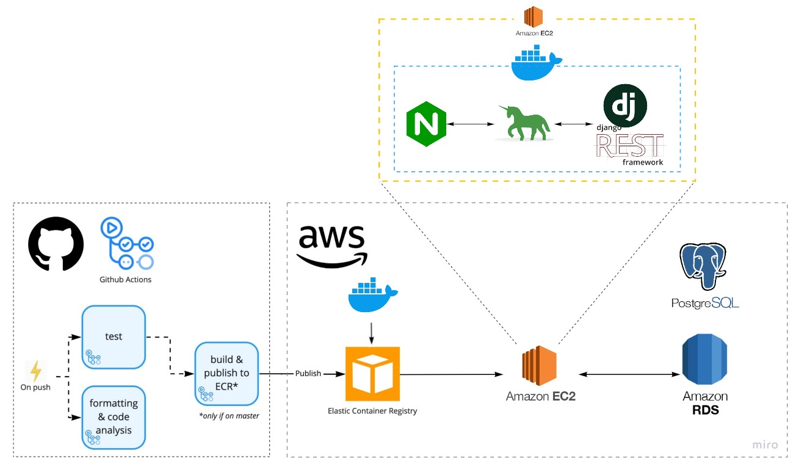

<h1 align="center">🎤FLAVOICE</h1>

  

> [FLAVOICE](https://flavoice.netlify.app/#/guide) - Link
## API DOCS
[Swagger API](https://flavoice.shop/swagger/)

## Architecture

## Repository
### [Backend](https://github.com/justzino/flavoice)
### [Crawling](https://github.com/justzino/flavoice-crawling)
### [Frontend](https://github.com/MoonSangJin/flavoice-front)

## Team

### Backend + Crawling
👤 **[justzino](https://github.com/justzino)**  - me

### Frontend
👤 **[MoonSangJin](https://github.com/MoonSangJin)**  
👤 **[simyeen](https://github.com/simyeen)**  
